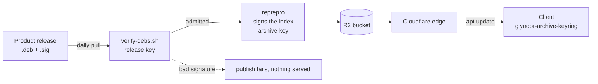

# Glyndor apt repository

Signed apt repository for Glyndor's Debian/Ubuntu packages (amd64, arm64),

[](https://github.com/Glyndor/.github/releases)
served at **https://apt.glyndor.net**.

[](https://github.com/Glyndor/apt/actions/workflows/publish.yml)
[](https://github.com/Glyndor/apt/actions/workflows/health-check.yml)

## Install

```bash
curl -fsSLO https://apt.glyndor.net/glyndor-archive-keyring.deb
sudo dpkg -i glyndor-archive-keyring.deb
sudo apt update
sudo apt install podup        # or any other Glyndor package
```

The keyring package installs the signing key and the source list. Because the
key ships as a package, apt owns it, so renewals arrive automatically with
`apt upgrade`.

### Verify the signing key

The first download of the keyring is the one step that trusts the transport, so
check the installed key's fingerprint against this page (a second channel,
independent of apt.glyndor.net):

```bash
gpg --show-keys /usr/share/keyrings/glyndor.gpg
```

It must print exactly:

```
9ADF 04EA 8C31 39CD B673  03CF A670 5C2E A153 F3D6
```

If it does not, remove the package (`sudo dpkg -r glyndor-archive-keyring`) and
report it via the Security tab.

## How it works



Two keys do two different jobs. The release key proves a package is the one its
product published; the archive key proves the index is the one this repository
built. A client checks the second, and this repository checks the first on the
client's behalf before anything enters the archive.

The repository is rebuilt fresh from the latest release of every Glyndor
product, so it always serves the current version, with no old-version support.
Every package is verified against Glyndor's Ed25519 release signature before it
enters the archive, and the published index is GPG-signed. A missing or invalid
signature fails the build, so nothing unsigned is ever served.
