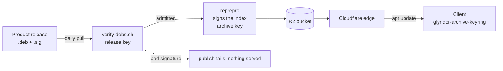

# Glyndor apt repository

Signed apt repository for Glyndor's Debian/Ubuntu packages (amd64, arm64),
served at **https://apt.glyndor.net**.

[](https://github.com/Glyndor/apt/actions/workflows/publish.yml)
[](https://github.com/Glyndor/apt/actions/workflows/health-check.yml)

## Install

The first download of the keyring is the one step that trusts the transport, so
check the key before installing it. `dpkg -i` runs the package's maintainer
scripts as root: a package that has not been checked yet must not be handed to
it.

```bash
curl -fsSLO https://apt.glyndor.net/glyndor-archive-keyring.deb
dpkg-deb -x glyndor-archive-keyring.deb keyring-check
gpg --show-keys keyring-check/usr/share/keyrings/glyndor.gpg
```

`dpkg-deb -x` unpacks the package without running anything from it.

### Verify the signing key

The command above must print exactly:

```
9ADF 04EA 8C31 39CD B673  03CF A670 5C2E A153 F3D6
```

This page is where that fingerprint is published, on a host that is not
apt.glyndor.net. Checking a key against the archive that served it would prove
nothing; comparing against a second channel is what makes the check worth
running, because an archive that has been tampered with cannot vouch for
itself.

If it does not match, delete the download and report it via the Security tab.
Do not install first and check afterwards: `dpkg -r` runs the package's removal
scripts, but it does not undo what a maintainer script already did as root, so
there is no recovery step to fall back on.

The same fingerprint applies to a copy that is already installed, which is at
`/usr/share/keyrings/glyndor.gpg`.

### Finish the install

Only once the fingerprint matches:

```bash
sudo dpkg -i glyndor-archive-keyring.deb
sudo apt update
sudo apt install podup
# to list every Glyndor package: apt list '?origin(Glyndor)'
```

The keyring package installs the signing key and the source list. Because the
key ships as a package, apt owns it, so renewals arrive automatically with
`apt upgrade`.

## How it works



Two keys do two different jobs. The release key proves a package is the one its
product published; the archive key proves the index is the one this repository
built. A client checks the second, and this repository checks the first on the
client's behalf before anything enters the archive.

The repository is rebuilt fresh from the latest release of every Glyndor
product, so it always serves the current version, with no old-version support.
Every package is verified against Glyndor's Ed25519 release signature before it
enters the archive, and the published index is GPG-signed. A missing or invalid
signature fails the build, so nothing unsigned is ever served.
