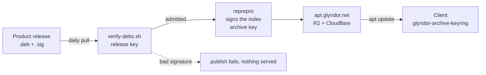

<div align="center">

# Glyndor apt repository

**Signed `.deb` packages for every Glyndor product.**
`amd64` and `arm64`, rebuilt daily, nothing unverified ever served

[](https://github.com/Glyndor/apt/actions/workflows/health-check.yml)
[](https://github.com/Glyndor/apt/actions/workflows/publish.yml)

</div>

## Install

```bash
curl -fsSL https://apt.glyndor.net/install/podup | sudo sh
```

It adds the archive, installs the signing key after checking its fingerprint,
installs the package, and switches on automatic security upgrades. Anything but
`Installing the keyring` after the fingerprint line means it refused: it exits
before `dpkg -i`, so nothing ran as root.

Swap `podup` for any package below.

| Package | What it is | In the archive |
| --- | --- | --- |
| [`podup`](https://github.com/Glyndor/podup) | Docker-compose translator and runner for rootless Podman | served |
| [`epistle`](https://github.com/Glyndor/epistle) | Self-hosted headless mail server: SMTP, IMAP | served |
| [`helmly-agent`](https://github.com/Glyndor/helmly-agent) | Hardened server agent for the Glyndor panel: signed commands over WireGuard and mTLS | not packaged |

```bash
apt list '?origin(Glyndor)'   # everything currently served
```

## Updates take care of themselves

The signing key ships **as a package**, so apt owns it, and the keyring puts
this archive on the `unattended-upgrades` allowlist. Nothing to re-run, no
expiry to diarise.

> [!NOTE]
> Debian ships neither `unattended-upgrades` nor the switch that turns it on;
> Ubuntu server ships both. The installer respects an existing setup rather
> than overriding it, and says so if it could not install one at all. In that
> case the archive is on the allowlist but nothing is applying it.

## How it works



**Two keys, two jobs.** The *release* key proves a package is the one its
product published; the *archive* key proves the index is the one this
repository built. You check the second, this repository checks the first.

Rebuilt from scratch every run, so the failure mode is *an archive that does not update*, never *one that serves something
unverified*.

## Verify the signing key

This is the **archive** key, the one apt uses to check the index. The
installer compares it for you; repeat it by hand to confirm a key already
installed, or if you would rather not pipe a network response into a shell.

```bash
curl -fsSLO https://apt.glyndor.net/glyndor-archive-keyring.deb
dpkg-deb -x glyndor-archive-keyring.deb keyring-check
gpg --show-keys keyring-check/usr/share/keyrings/glyndor.gpg
```

Nothing from the package runs. It must print **exactly**:

```
9ADF 04EA 8C31 39CD B673  03CF A670 5C2E A153 F3D6
```

Published here, not on `apt.glyndor.net`. A tampered archive cannot vouch for
itself. Same value for a copy already installed, at
`/usr/share/keyrings/glyndor.gpg`.

> [!CAUTION]
> `dpkg -i` runs maintainer scripts as root. If it does not match, delete the
> download and report it via the **Security** tab. `dpkg -r` does not undo
> what a maintainer script already did.

Only once it matches:

```bash
sudo dpkg -i glyndor-archive-keyring.deb
```

> [!WARNING]
> Do not stop here and install the package with apt. The keyring puts this
> archive on the allowlist, but an allowlist does nothing on a machine that is
> not running unattended upgrades, and only the script installs and switches
> those on. Run the install command at the top instead.

---

See [CONTRIBUTING.md](CONTRIBUTING.md). The tests are the specification;
the [threat model](docs/threat-model.md) says what they specify against.

[MIT](LICENSE). Report a problem via the
[Security](https://github.com/Glyndor/apt/security) tab.
